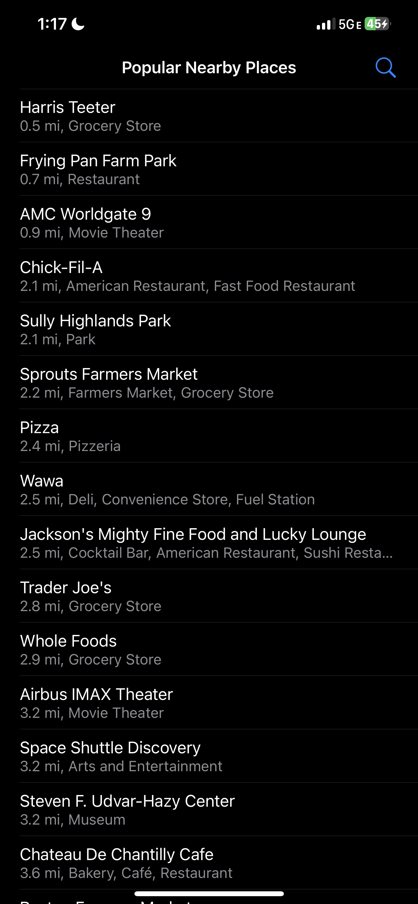
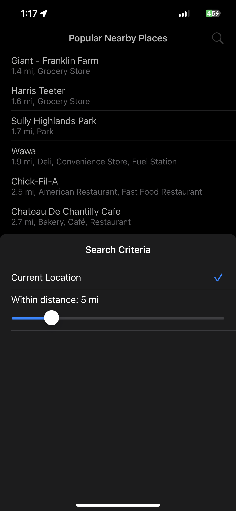

# adyen-places-ios
iOS App coding challenge for Adyen

# Key functions
- Show nearby places based on devices IP address and user's current location
- Shows place name, distance and categories in this MVP
- Tap and select a place to automatically open Apple Maps for directions
- Supports dark and light mode
- Honors dynamic text sizing
- Most important A11y use cases
- Authored XCTest (code coverage above 25%) and XCUITest
- Can easily support internationalization
- Can easily scale to support user preferences based metrics and cases

# Build Requirements
Xcode 14.3 or above

iOS, iPadOS 15 and above

Swift Package Dependency: https://github.com/Adyen/adyen-networking-ios

# Screenshots
</img>

</img>
